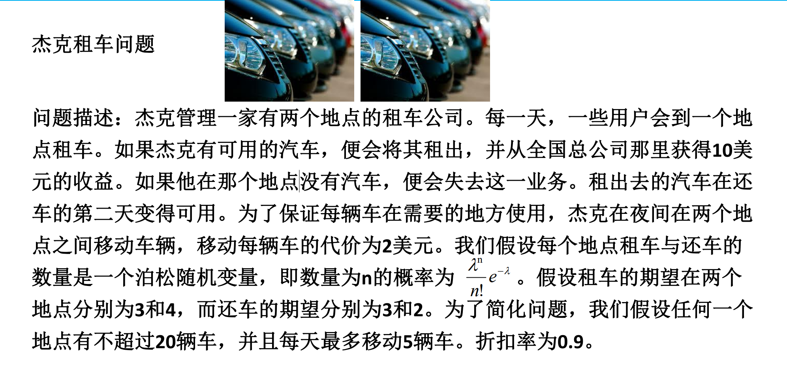
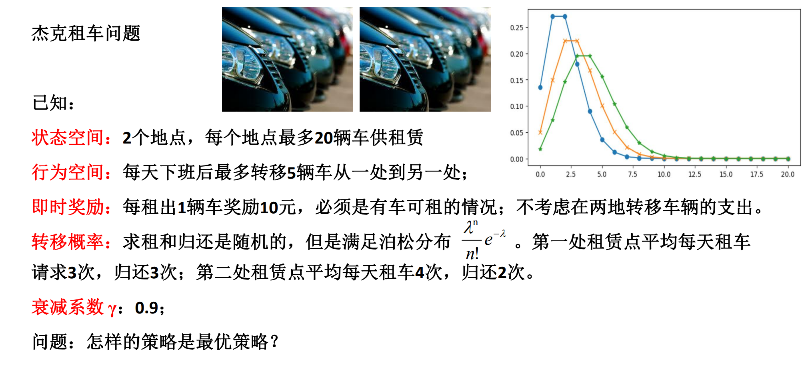
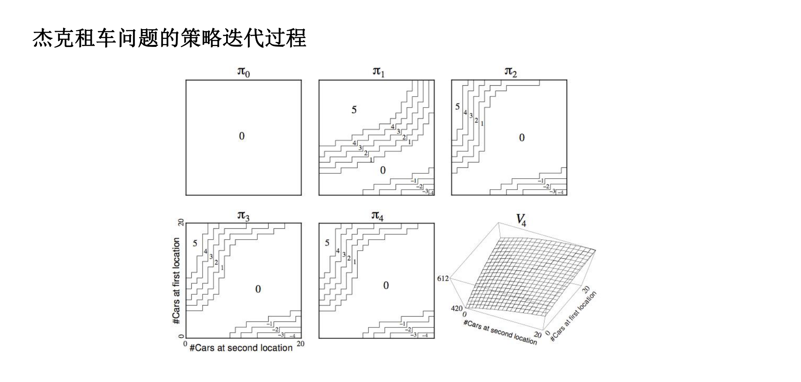
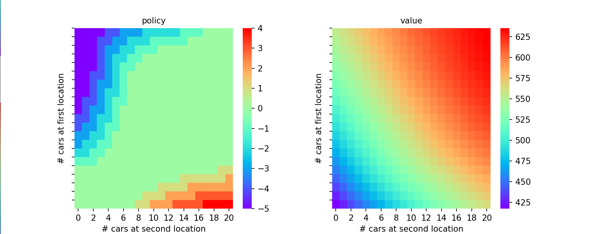
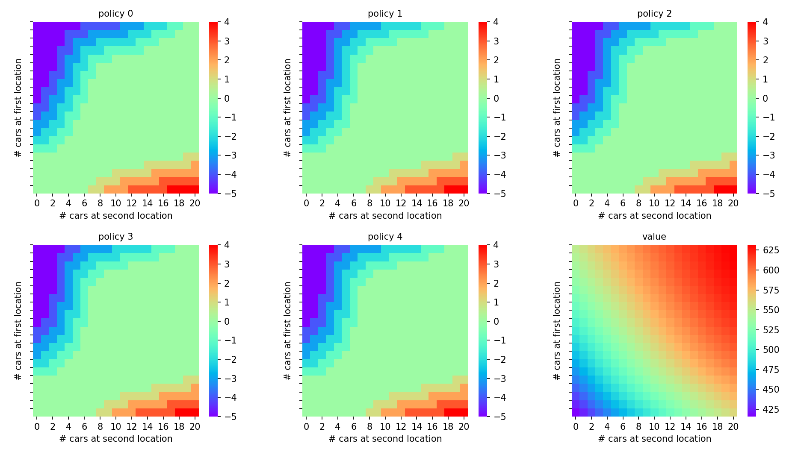
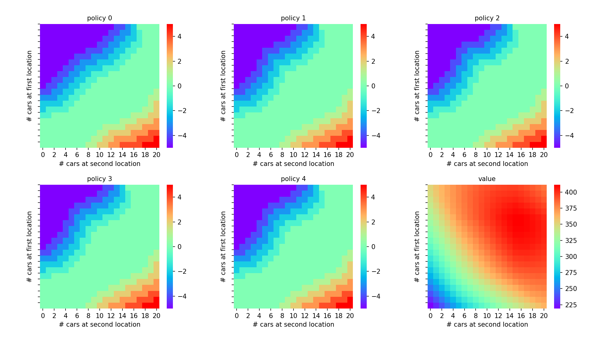
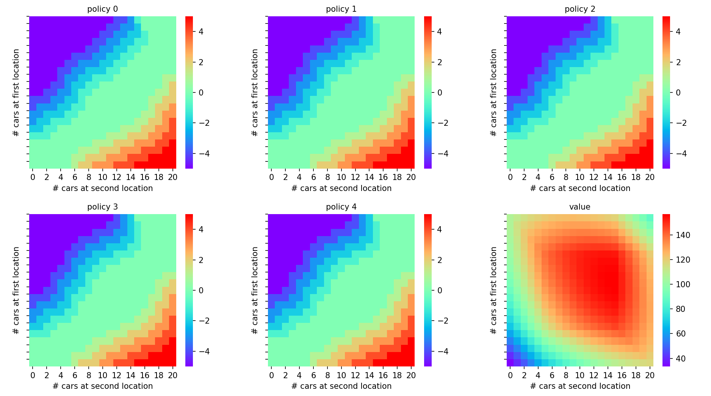
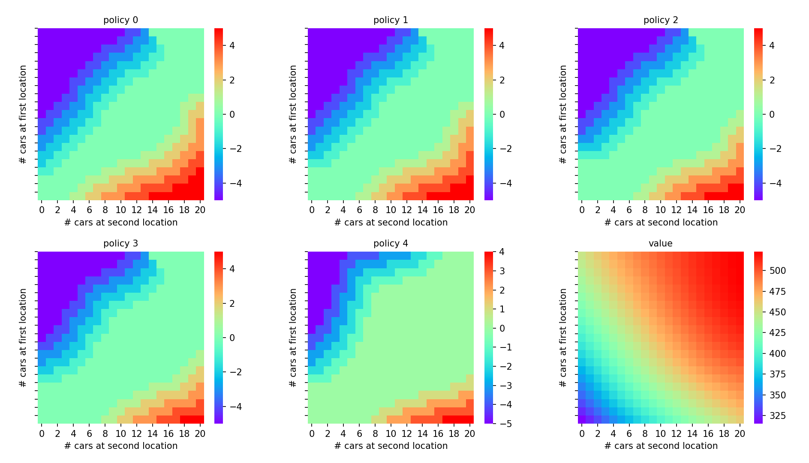

# 杰克出租车问题

## 问题描述







## 相关函数

```python
import numpy as np
from scipy.stats import poisson
import matplotlib.pyplot as plt
import os
import seaborn as sns

GAMMA = 0.9
MAX_CAR_NUM = 20
E1out = 3
# 地点1租车的期望
E1in = 3
# 地点1还车的期望
E2out = 4
E2in = 2

ONE_CAR_INPUT = 10

ACTION = [-5, -4, -3, -2, -1, 0, 1, 2, 3, 4, 5]
ACTION_NUM = 11

terminal = 1
# 1e-1，1e-2,1e-3

E_greedy = 0.01
E_greedy_M = E_greedy / MAX_CAR_NUM
```

**头文件：**

- `GAMMA = 0.9`：折扣因子，用于计算未来奖励的影响。值越接近 1，意味着未来奖励的影响越大。
- `MAX_CAR_NUM = 20`：最大可用车辆数量，表示两地最多有 20 辆车。
- `E1out = 3` 和 `E1in = 3`：地点1租车和还车的期望值（泊松分布的参数）。
- `E2out = 4` 和 `E2in = 2`：地点2租车和还车的期望值（泊松分布的参数）。
- `ONE_CAR_INPUT = 10`：每辆车的租赁输入奖励，用于计算每个状态的奖励。
- `ACTION = [-5, -4, -3, -2, -1, 0, 1, 2, 3, 4, 5]`：可能的动作列表，表示将车辆从一个地点移到另一个地点的变化量。动作的取值范围是 -5 到 +5，表示最多移动 5 辆车。
- `ACTION_NUM = 11`：表示一共有 11 种不同的动作选择。
- `terminal = 1`：用于控制迭代的精度。当值函数变化的最大误差小于此阈值时，迭代停止。

​	ε-贪婪策略的设置：

- `E_greedy `：e_greedy的值。
- `E_greedy_M = E_greedy / MAX_CAR_NUM`：这是计算 ε-greedy 策略中探索概率的方式。具体来说，当 `E_greedy = 0` 时，`E_greedy_M = 0`，意味着没有任何探索行为,即此时的策略为greedy策略。


```
P1 = np.zeros(shape=(MAX_CAR_NUM + 1, MAX_CAR_NUM + 1)).astype("float32")
# P1[x][y]对应了地点1中由x辆车变成y辆车的概率
P2 = np.zeros(shape=(MAX_CAR_NUM + 1, MAX_CAR_NUM + 1)).astype("float32")
# R = np.zeros(shape=(MAX_CAR_NUM+1, MAX_CAR_NUM+1)).astype("float32")
# # R[x][y]表示地点1和地点2分别有x和y辆车时获得奖励的期望
# 不再使用，每个状态的收获是动态的，而不是简单的期望
Rs = np.zeros(shape=(MAX_CAR_NUM + 1, MAX_CAR_NUM + 1)).astype("float32")


# R[x][y]表示Rt为状态为(x,y)时的Rs，表示的是移动车辆以后的状态


def init_p():
    for i in range(0, MAX_CAR_NUM + 1):
        for d_in in range(0, MAX_CAR_NUM + 1):
            for d_out in range(0, MAX_CAR_NUM + 1):
                j_to = max(i - d_out, 0)
                j_to = min(j_to + d_in, MAX_CAR_NUM)
                P1[i][j_to] += poisson.pmf(k=d_out, mu=E1out) * poisson.pmf(k=d_in, mu=E1in)
                P2[i][j_to] += poisson.pmf(k=d_out, mu=E2out) * poisson.pmf(k=d_in, mu=E2in)

            # if i < E1out:
            #     R[i][j] += i
            # else:
            #     R[i][j] += E1out
            # if j < E2out:
            #     R[i][j] += j
            # else:
            #     R[i][j] += E2out


def init_rs():
    # i,j表示执行动作以后状态两地分别有i,j辆车
    # Rs是定值
    for i in range(0, MAX_CAR_NUM + 1):
        for j in range(0, MAX_CAR_NUM + 1):
            for e1out in range(0, MAX_CAR_NUM + 1):
                for e2out in range(0, MAX_CAR_NUM + 1):
                    reward = float((min(i, e1out) + min(j, e2out)) * ONE_CAR_INPUT)
                    # 当前有四辆，借了五辆，用借五辆的概率，借走四辆的收获
                    Rs[i][j] += poisson.pmf(k=e1out, mu=E1out) * poisson.pmf(k=e2out, mu=E2out) * reward
```

对应了三个初始化的数组，这三个数组分别表示:

`P1[i][j]`:表示第一个地点从i辆车变为j辆车的概率

`P2[i][j]`:表示第二个地点从i辆车变为j辆车的概率

`Rs[i][j]`:i,j表示经过某一动作后两地分别有i,j辆车，`Rs[i][j]`则为由i,j到所有状态的回报的期望，这里i,j到每种状态的概率是固定的，因此Rs也是固定的

```
def get_state_action_v(state, action, value):
    i = state[0]
    j = state[1]
    now_i = i + action
    now_j = j - action
    # now_i,now_j表示执行动作以后状态两地分别有i,j辆车
    results = 0
    if 0 <= now_i <= MAX_CAR_NUM and 0 <= now_j <= MAX_CAR_NUM:
        for to_i in range(0, MAX_CAR_NUM + 1):
            for to_j in range(0, MAX_CAR_NUM + 1):
                results += P1[now_i][to_i] * P2[now_j][to_j] * value[to_i][to_j] * GAMMA
        results += Rs[now_i][now_j] - abs(action) * 2  # 减去移动车辆的代价
    else:
        results = 0
    return results


def update_state_action_v(value):
    state_action_value = np.zeros(shape=(MAX_CAR_NUM + 1, MAX_CAR_NUM + 1, ACTION_NUM)).astype("float32")
    for i in range(0, MAX_CAR_NUM + 1):
        for j in range(0, MAX_CAR_NUM + 1):
            # 遍历所有状态
            for which_action in range(ACTION_NUM):
                # 遍历所有action,并找出最大值
                now_action = ACTION[which_action]
                now_i = i + now_action
                now_j = j - now_action
                # now_i,now_j表示执行动作以后两地分别有now_i,now_j辆车
                if 0 <= now_i <= MAX_CAR_NUM and 0 <= now_j <= MAX_CAR_NUM:
                    for to_i in range(0, MAX_CAR_NUM + 1):
                        for to_j in range(0, MAX_CAR_NUM + 1):
                            state_action_value[i][j][which_action] += P1[now_i][to_i] * P2[now_j][to_j] * value[to_i][
                                to_j] * GAMMA
                    state_action_value[i][j][which_action] += Rs[now_i][now_j] - abs(now_action) * 2  # 减去移动车辆的代价
                else:
                    state_action_value[i][j][which_action] = 0
    return state_action_value
```

`get_state_action_v()`是返回某一状态下执行某一动作的价值，即动作价值函数`Q(s,a)`

`update_state_action_v()`是根据输入的value数组，得到所有状态和动作的动作价值函数`Q(s,a)`

```
def get_E_greedy_strategy(state_action_value):
    strategy = np.ones(shape=(MAX_CAR_NUM + 1, MAX_CAR_NUM + 1, ACTION_NUM)).astype("float32")
    strategy = strategy * E_greedy_M
    for i in range(0, MAX_CAR_NUM + 1):
        for j in range(0, MAX_CAR_NUM + 1):
            values = state_action_value[i][j]
            max_action_index = np.argmax(values)
            strategy[i][j][max_action_index] += 1 - E_greedy
    return strategy
```

`get_E_greedy_strategy()`根据输入的动作价值数组，返回一个三维策略数组，即根据该动作价值得到的e-greedy策略，其对应了各种状态下执行各种动作的概率，如`strategy[i][j][k]`表示i,j状态时执行ACTION数组下索引为k的动作的概率。

```
def get_greedy_action(state_action_value):
    best_action = np.zeros(shape=(MAX_CAR_NUM + 1, MAX_CAR_NUM + 1)).astype("int")
    for i in range(0, MAX_CAR_NUM + 1):
        for j in range(0, MAX_CAR_NUM + 1):
            values = state_action_value[i][j]
            best_action[i][j] = ACTION[np.argmax(values)]
    return best_action
```

`get_greedy_action(state_action_value)`根据输入的动作价值数组，返回一个二维策略数组，这个数组对应了各个状态下的greedy策略，直接是移动车辆的具体数量

## 价值迭代

### 同步价值迭代

```
def SYN_VALUE_ITER():
    # 同步

    fig, axes = plt.subplots(1, 2, figsize=(10, 4))
    plt.subplots_adjust(wspace=0.3, hspace=0.3)
    axes = axes.flatten()

    value = np.zeros(shape=(MAX_CAR_NUM + 1, MAX_CAR_NUM + 1)).astype("float32")
    temp_V = np.zeros(shape=(MAX_CAR_NUM + 1, MAX_CAR_NUM + 1)).astype("float32")
    iterations = 0
    while True:
        state_action_value = update_state_action_v(value)
        for i in range(0, MAX_CAR_NUM + 1):
            for j in range(0, MAX_CAR_NUM + 1):
                values = state_action_value[i][j]
                temp_V[i][j] = np.max(values)
        errand = abs(temp_V - value).max()
        print("now's iterations: {} , errand is: {}\n".format(iterations, errand))
        iterations += 1
        if errand < terminal:
            strategy = get_greedy_action(state_action_value)
            break
        value = temp_V.copy()  # 把新表值赋给旧表
        # 画图
    fig = sns.heatmap(np.flipud(strategy), cmap="rainbow", ax=axes[0])
    fig.set_ylabel('# cars at first location', fontsize=10)
    fig.set_yticks(list(reversed(range(MAX_CAR_NUM + 1))))
    fig.set_xlabel('# cars at second location', fontsize=10)
    fig.set_title('policy', fontsize=10)
    fig = sns.heatmap(np.flipud(value), cmap="rainbow", ax=axes[1])
    fig.set_ylabel('# cars at first location', fontsize=10)
    fig.set_yticks(list(reversed(range(MAX_CAR_NUM + 1))))
    fig.set_xlabel('# cars at second location', fontsize=10)
    fig.set_title('value', fontsize=10)
    plt.show()
    return value, strategy
```

所有状态更新完后才将value替换为新表

### 异步价值迭代

```
def ASY_VALUE_ITER():
    fig, axes = plt.subplots(1, 2, figsize=(10, 4))
    plt.subplots_adjust(wspace=0.3, hspace=0.3)
    axes = axes.flatten()

    # 异步
    value = np.zeros(shape=(MAX_CAR_NUM + 1, MAX_CAR_NUM + 1)).astype("float32")
    iterations = 0
    while True:
        old_value = value.copy()
        for i in range(0, MAX_CAR_NUM + 1):
            for j in range(0, MAX_CAR_NUM + 1):
                max_value = 0
                for which_action in range(ACTION_NUM):
                    # 遍历所有action,并找出最大值
                    now_action = ACTION[which_action]
                    this_v = get_state_action_v((i, j), now_action, value)
                    if this_v > max_value:
                        max_value = this_v
                value[i][j] = max_value
        errand = abs(old_value - value).max()
        print("now's iterations: {} , errand is: {}\n".format(iterations, errand))
        iterations += 1
        if errand < terminal:
            state_action_value = update_state_action_v(value)
            strategy = get_greedy_action(state_action_value)
            break
            # 画图
    fig = sns.heatmap(np.flipud(strategy), cmap="rainbow", ax=axes[0])
    fig.set_ylabel('# cars at first location', fontsize=10)
    fig.set_yticks(list(reversed(range(MAX_CAR_NUM + 1))))
    fig.set_xlabel('# cars at second location', fontsize=10)
    fig.set_title('policy', fontsize=10)
    fig = sns.heatmap(np.flipud(value), cmap="rainbow", ax=axes[1])
    fig.set_ylabel('# cars at first location', fontsize=10)
    fig.set_yticks(list(reversed(range(MAX_CAR_NUM + 1))))
    fig.set_xlabel('# cars at second location', fontsize=10)
    fig.set_title('value', fontsize=10)
    plt.show()
    return value, strategy
```

每得到一个新状态的价值就更新value

### 运行结果

两种价值迭代的结果都如下图:

（虽然结果相同，但是同步价值迭代更慢，每次变化的值较小，迭代了60轮才收敛到合适值，而异步价值迭代只迭代了45轮左右即收敛）



## 策略迭代

```
def POLICY_ITER():
    fig, axes = plt.subplots(2, 3, figsize=(15, 8))
    plt.subplots_adjust(wspace=0.3, hspace=0.3)
    axes = axes.flatten()

    iterations_num = 5
    value = np.ones(shape=(MAX_CAR_NUM + 1, MAX_CAR_NUM + 1)).astype("float32")
    best_strategy = np.zeros(shape=(MAX_CAR_NUM + 1, MAX_CAR_NUM + 1)).astype("float32")
    for iterations in range(iterations_num):
        last_value = value.copy()

        state_action_value = update_state_action_v(value)
        strategy = get_E_greedy_strategy(state_action_value)

        while True:
            old_value = value.copy()
            state_action_value = update_state_action_v(value)
            value = np.zeros(shape=(MAX_CAR_NUM + 1, MAX_CAR_NUM + 1)).astype("float32")
            for i in range(0, MAX_CAR_NUM + 1):
                for j in range(0, MAX_CAR_NUM + 1):
                    # 遍历所有状态
                    for which_action in range(ACTION_NUM):
                        # 遍历所有action
                        value[i][j] += strategy[i][j][which_action] * state_action_value[i][j][which_action]
            errand = abs(old_value - value).max()
            print("strategy evaluate: errand is: {}\n".format(errand))
            if errand < terminal:
                break

        errand = abs(last_value - value).max()
        print("now iterations is:{} errand is: {}\n".format(iterations, errand))
        best_strategy = get_greedy_action(state_action_value)
        fig = sns.heatmap(np.flipud(best_strategy), cmap="rainbow", ax=axes[iterations])
        # 定义标签与标题
        fig.set_ylabel('# cars at first location', fontsize=10)
        fig.set_yticks(list(reversed(range(MAX_CAR_NUM + 1))))
        fig.set_xlabel('# cars at second location', fontsize=10)
        fig.set_title('policy {}'.format(iterations), fontsize=10)
    fig = sns.heatmap(np.flipud(value), cmap="rainbow", ax=axes[5])
    fig.set_ylabel('# cars at first location', fontsize=10)
    fig.set_yticks(list(reversed(range(MAX_CAR_NUM + 1))))
    fig.set_xlabel('# cars at second location', fontsize=10)
    fig.set_title('value', fontsize=10)
    plt.show()
    return value, best_strategy
```

重复五次 *策略改进->策略评估*的过程，策略改进直接调用之前定义好的`get_E_greedy_strategy()`函数

### 运行结果

- 当e为0时，此时的e-greedy变为了greedy策略

  

  如图，发现最终得到的策略与之前的价值迭代策略相同，同时，第一次迭代之后就与最终的情况较为类似，并且第二次迭代之后就已经约等于最优策略了

- 当e为0.1时，此时的e-greedy变为了greedy策略

  

  如图，发现e-greedy策略并不能使价值收敛到最优的，其相较于greedy，试探了跟多的动作，即相较greedy更倾向于移动车辆，因此每次的Reward减去的one_car_cost更多，故价值较低。

- 当e为0.5时

  

  如图，此时情况相较于e等于0.1,策略探索更多，价值也更低

## 完整代码

```
import numpy as np
from scipy.stats import poisson
import matplotlib.pyplot as plt
import os
import seaborn as sns

GAMMA = 0.9
MAX_CAR_NUM = 20
E1out = 3
# 地点1租车的期望
E1in = 3
# 地点1还车的期望
E2out = 4
E2in = 2

ONE_CAR_INPUT = 10

ACTION = [-5, -4, -3, -2, -1, 0, 1, 2, 3, 4, 5]
ACTION_NUM = 11

terminal = 1

E_greedy = 0
E_greedy_M = E_greedy / MAX_CAR_NUM

P1 = np.zeros(shape=(MAX_CAR_NUM + 1, MAX_CAR_NUM + 1)).astype("float32")
# P1[x][y]对应了地点1中由x辆车变成y辆车的概率
P2 = np.zeros(shape=(MAX_CAR_NUM + 1, MAX_CAR_NUM + 1)).astype("float32")
# R = np.zeros(shape=(MAX_CAR_NUM+1, MAX_CAR_NUM+1)).astype("float32")
# # R[x][y]表示地点1和地点2分别有x和y辆车时获得奖励的期望
# 不再使用，每个状态的收获是动态的，而不是简单的期望
Rs = np.zeros(shape=(MAX_CAR_NUM + 1, MAX_CAR_NUM + 1)).astype("float32")


# R[x][y]表示Rt为状态为(x,y)时的Rs，表示的是移动车辆以后的状态


def init_p():
    for i in range(0, MAX_CAR_NUM + 1):
        for d_in in range(0, MAX_CAR_NUM + 1):
            for d_out in range(0, MAX_CAR_NUM + 1):
                j_to = max(i - d_out, 0)
                j_to = min(j_to + d_in, MAX_CAR_NUM)
                P1[i][j_to] += poisson.pmf(k=d_out, mu=E1out) * poisson.pmf(k=d_in, mu=E1in)
                P2[i][j_to] += poisson.pmf(k=d_out, mu=E2out) * poisson.pmf(k=d_in, mu=E2in)

            # if i < E1out:
            #     R[i][j] += i
            # else:
            #     R[i][j] += E1out
            # if j < E2out:
            #     R[i][j] += j
            # else:
            #     R[i][j] += E2out


def init_rs():
    # i,j表示执行动作以后状态两地分别有i,j辆车
    # Rs是定值
    for i in range(0, MAX_CAR_NUM + 1):
        for j in range(0, MAX_CAR_NUM + 1):
            for e1out in range(0, MAX_CAR_NUM + 1):
                for e2out in range(0, MAX_CAR_NUM + 1):
                    reward = float((min(i, e1out) + min(j, e2out)) * ONE_CAR_INPUT)
                    # 当前有四辆，借了五辆，用借五辆的概率，借走四辆的收获
                    Rs[i][j] += poisson.pmf(k=e1out, mu=E1out) * poisson.pmf(k=e2out, mu=E2out) * reward


def get_state_action_v(state, action, value):
    i = state[0]
    j = state[1]
    now_i = i + action
    now_j = j - action
    # now_i,now_j表示执行动作以后状态两地分别有i,j辆车
    results = 0
    if 0 <= now_i <= MAX_CAR_NUM and 0 <= now_j <= MAX_CAR_NUM:
        for to_i in range(0, MAX_CAR_NUM + 1):
            for to_j in range(0, MAX_CAR_NUM + 1):
                results += P1[now_i][to_i] * P2[now_j][to_j] * value[to_i][to_j] * GAMMA
        results += Rs[now_i][now_j] - abs(action) * 2  # 减去移动车辆的代价
    else:
        results = 0
    return results


def update_state_action_v(value):
    state_action_value = np.zeros(shape=(MAX_CAR_NUM + 1, MAX_CAR_NUM + 1, ACTION_NUM)).astype("float32")
    for i in range(0, MAX_CAR_NUM + 1):
        for j in range(0, MAX_CAR_NUM + 1):
            # 遍历所有状态
            for which_action in range(ACTION_NUM):
                # 遍历所有action,并找出最大值
                now_action = ACTION[which_action]
                now_i = i + now_action
                now_j = j - now_action
                # now_i,now_j表示执行动作以后两地分别有now_i,now_j辆车
                if 0 <= now_i <= MAX_CAR_NUM and 0 <= now_j <= MAX_CAR_NUM:
                    for to_i in range(0, MAX_CAR_NUM + 1):
                        for to_j in range(0, MAX_CAR_NUM + 1):
                            state_action_value[i][j][which_action] += P1[now_i][to_i] * P2[now_j][to_j] * value[to_i][
                                to_j] * GAMMA
                    state_action_value[i][j][which_action] += Rs[now_i][now_j] - abs(now_action) * 2  # 减去移动车辆的代价
                else:
                    state_action_value[i][j][which_action] = 0
    return state_action_value


def get_E_greedy_strategy(state_action_value):
    strategy = np.ones(shape=(MAX_CAR_NUM + 1, MAX_CAR_NUM + 1, ACTION_NUM)).astype("float32")
    strategy = strategy * E_greedy_M
    for i in range(0, MAX_CAR_NUM + 1):
        for j in range(0, MAX_CAR_NUM + 1):
            values = state_action_value[i][j]
            max_action_index = np.argmax(values)
            strategy[i][j][max_action_index] += 1 - E_greedy
    return strategy


def get_greedy_action(state_action_value):
    best_action = np.zeros(shape=(MAX_CAR_NUM + 1, MAX_CAR_NUM + 1)).astype("int")
    for i in range(0, MAX_CAR_NUM + 1):
        for j in range(0, MAX_CAR_NUM + 1):
            values = state_action_value[i][j]
            best_action[i][j] = ACTION[np.argmax(values)]
    return best_action


def SYN_VALUE_ITER():
    # 同步

    fig, axes = plt.subplots(1, 2, figsize=(10, 4))
    plt.subplots_adjust(wspace=0.3, hspace=0.3)
    axes = axes.flatten()

    value = np.zeros(shape=(MAX_CAR_NUM + 1, MAX_CAR_NUM + 1)).astype("float32")
    temp_V = np.zeros(shape=(MAX_CAR_NUM + 1, MAX_CAR_NUM + 1)).astype("float32")
    iterations = 0
    while True:
        state_action_value = update_state_action_v(value)
        for i in range(0, MAX_CAR_NUM + 1):
            for j in range(0, MAX_CAR_NUM + 1):
                values = state_action_value[i][j]
                temp_V[i][j] = np.max(values)
        errand = abs(temp_V - value).max()
        print("now's iterations: {} , errand is: {}\n".format(iterations, errand))
        iterations += 1
        if errand < terminal:
            strategy = get_greedy_action(state_action_value)
            break
        value = temp_V.copy()  # 把新表值赋给旧表
        # 画图
    fig = sns.heatmap(np.flipud(strategy), cmap="rainbow", ax=axes[0])
    fig.set_ylabel('# cars at first location', fontsize=10)
    fig.set_yticks(list(reversed(range(MAX_CAR_NUM + 1))))
    fig.set_xlabel('# cars at second location', fontsize=10)
    fig.set_title('policy', fontsize=10)
    fig = sns.heatmap(np.flipud(value), cmap="rainbow", ax=axes[1])
    fig.set_ylabel('# cars at first location', fontsize=10)
    fig.set_yticks(list(reversed(range(MAX_CAR_NUM + 1))))
    fig.set_xlabel('# cars at second location', fontsize=10)
    fig.set_title('value', fontsize=10)
    plt.show()
    return value, strategy


def ASY_VALUE_ITER():
    fig, axes = plt.subplots(1, 2, figsize=(10, 4))
    plt.subplots_adjust(wspace=0.3, hspace=0.3)
    axes = axes.flatten()

    # 异步
    value = np.zeros(shape=(MAX_CAR_NUM + 1, MAX_CAR_NUM + 1)).astype("float32")
    iterations = 0
    while True:
        old_value = value.copy()
        for i in range(0, MAX_CAR_NUM + 1):
            for j in range(0, MAX_CAR_NUM + 1):
                max_value = 0
                for which_action in range(ACTION_NUM):
                    # 遍历所有action,并找出最大值
                    now_action = ACTION[which_action]
                    this_v = get_state_action_v((i, j), now_action, value)
                    if this_v > max_value:
                        max_value = this_v
                value[i][j] = max_value
        errand = abs(old_value - value).max()
        print("now's iterations: {} , errand is: {}\n".format(iterations, errand))
        iterations += 1
        if errand < terminal:
            state_action_value = update_state_action_v(value)
            strategy = get_greedy_action(state_action_value)
            break
            # 画图
    fig = sns.heatmap(np.flipud(strategy), cmap="rainbow", ax=axes[0])
    fig.set_ylabel('# cars at first location', fontsize=10)
    fig.set_yticks(list(reversed(range(MAX_CAR_NUM + 1))))
    fig.set_xlabel('# cars at second location', fontsize=10)
    fig.set_title('policy', fontsize=10)
    fig = sns.heatmap(np.flipud(value), cmap="rainbow", ax=axes[1])
    fig.set_ylabel('# cars at first location', fontsize=10)
    fig.set_yticks(list(reversed(range(MAX_CAR_NUM + 1))))
    fig.set_xlabel('# cars at second location', fontsize=10)
    fig.set_title('value', fontsize=10)
    plt.show()
    return value, strategy


def POLICY_ITER():
    fig, axes = plt.subplots(2, 3, figsize=(15, 8))
    plt.subplots_adjust(wspace=0.3, hspace=0.3)
    axes = axes.flatten()

    iterations_num = 5
    value = np.ones(shape=(MAX_CAR_NUM + 1, MAX_CAR_NUM + 1)).astype("float32")
    best_strategy = np.zeros(shape=(MAX_CAR_NUM + 1, MAX_CAR_NUM + 1)).astype("float32")
    for iterations in range(iterations_num):
        last_value = value.copy()

        state_action_value = update_state_action_v(value)
        strategy = get_E_greedy_strategy(state_action_value)

        while True:
            old_value = value.copy()
            state_action_value = update_state_action_v(value)
            value = np.zeros(shape=(MAX_CAR_NUM + 1, MAX_CAR_NUM + 1)).astype("float32")
            for i in range(0, MAX_CAR_NUM + 1):
                for j in range(0, MAX_CAR_NUM + 1):
                    # 遍历所有状态
                    for which_action in range(ACTION_NUM):
                        # 遍历所有action
                        value[i][j] += strategy[i][j][which_action] * state_action_value[i][j][which_action]
            errand = abs(old_value - value).max()
            print("strategy evaluate: errand is: {}\n".format(errand))
            if errand < terminal:
                break

        errand = abs(last_value - value).max()
        print("now iterations is:{} errand is: {}\n".format(iterations, errand))
        best_strategy = get_greedy_action(state_action_value)
        fig = sns.heatmap(np.flipud(best_strategy), cmap="rainbow", ax=axes[iterations])
        # 定义标签与标题
        fig.set_ylabel('# cars at first location', fontsize=10)
        fig.set_yticks(list(reversed(range(MAX_CAR_NUM + 1))))
        fig.set_xlabel('# cars at second location', fontsize=10)
        fig.set_title('policy {}'.format(iterations), fontsize=10)
    fig = sns.heatmap(np.flipud(value), cmap="rainbow", ax=axes[5])
    fig.set_ylabel('# cars at first location', fontsize=10)
    fig.set_yticks(list(reversed(range(MAX_CAR_NUM + 1))))
    fig.set_xlabel('# cars at second location', fontsize=10)
    fig.set_title('value', fontsize=10)
    plt.show()
    return value, best_strategy


def show(in_array):
    plt.imshow(in_array, cmap='plasma', vmin=np.min(in_array), vmax=np.max(in_array))  # 使用 'plasma' 渐变色
    plt.colorbar()  # 显示颜色条
    plt.title('Float32 2D Array Visualization (Darker for Larger Values with Plasma)')
    plt.show()


if_load = True
# 是否从保存下来的文件中加载P1,P2,Rs数组，若不加载，则重新生成并保存
if if_load:
    P1 = np.load('P1.npy')
    P2 = np.load('P2.npy')
    Rs = np.load('Rs.npy')
    # show(np.flipud(P1))
    # show(np.flipud(P2))
    # show(np.flipud(Rs))
else:
    os.chdir(r'C:\Users\lenovo\Desktop\RLGo')
    init_p()
    show(np.flipud(P1))
    show(np.flipud(P2))
    init_rs()
    show(np.flipud(Rs))
    np.save('P1.npy', P1)
    np.save('p2.npy', P2)
    np.save('Rs.npy', Rs)

# Value, Strategy = ASY_VALUE_ITER()
# Value, Strategy = SYN_VALUE_ITER()
Value, Strategy = POLICY_ITER()
# show(np.flipud(Strategy))
# show(np.flipud(Value))

```

## 遇到的问题

- 策略迭代与给出的情况并不一样，事实上，在第一轮迭代时就已经与正确的策略非常接近了

  ```
  def test():
      value = np.ones(shape=(MAX_CAR_NUM + 1, MAX_CAR_NUM + 1)).astype("float32")
      state_action_value = update_state_action_v(value)
      strategy = get_greedy_action(state_action_value)
      show(strategy)
  ```

  使用如上代码测试，发现出来的策略与最优策略非常接近，分析原因，应该是该本问题较为简单，并且我使用了Rs来直接表示每个动作后的价值期望，使得`update_state_action_v(value)`后直接得到了较好的`state_action_value`，根据这个数组，得到的动作即已属较优。

  再者可能的原因是题目给出的策略迭代使用了e-greedy策略，且这个e在随着迭代的进行逐渐降低，最终降为0，尝试使用这种推论：

  ```
  more_E_greedy = [0.8, 0.4, 0.2, 0.1, 0.01]
  more_E_greedy_M = [more_E_greedy[i] / MAX_CAR_NUM for i in range(5)]
  ```

  

  如图，与题中给出的收敛情况较为相似
